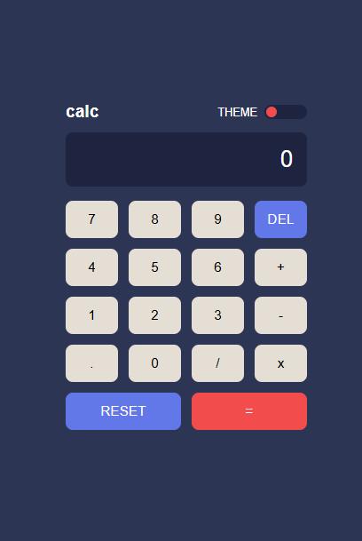

# Frontend Mentor - Calculator App

This is a solution to the [Calculator app challenge on Frontend Mentor](https://www.frontendmentor.io/challenges/calculator-app-9lteq5N29).  
Frontend Mentor challenges help you improve your coding skills by building realistic projects.

---

## 📌 Overview

### Screenshot


### Links
- Live Site URL: [GitHub Pages](https://ayomide0908.github.io/fm_calculator/)

---

## 🔧 Built With
- Semantic **HTML5** markup  
- **CSS** custom properties (variables)  
- **Flexbox** and **Grid** for layout  
- **Vanilla JavaScript** for calculator logic  
- GitHub Pages for deployment  

---

## 🚀 Features
- Fully functional calculator with add, subtract, multiply, and divide  
- Supports **reset** and **delete** actions  
- Multiple **themes** toggle  
- Responsive design for desktop and mobile  

---

## 💡 What I Learned
- How to structure a calculator app with clear logic in JavaScript  
- Using CSS variables for theme switching  
- Deploying projects with GitHub Pages  

---

## 🖥️ How to Use Locally
1. Clone the repo:
   ```bash
   git clone https://github.com/yourusername/fm_calculator.git
